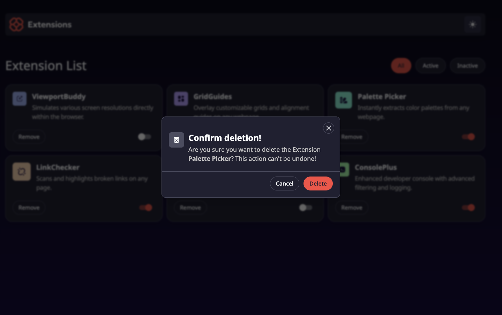
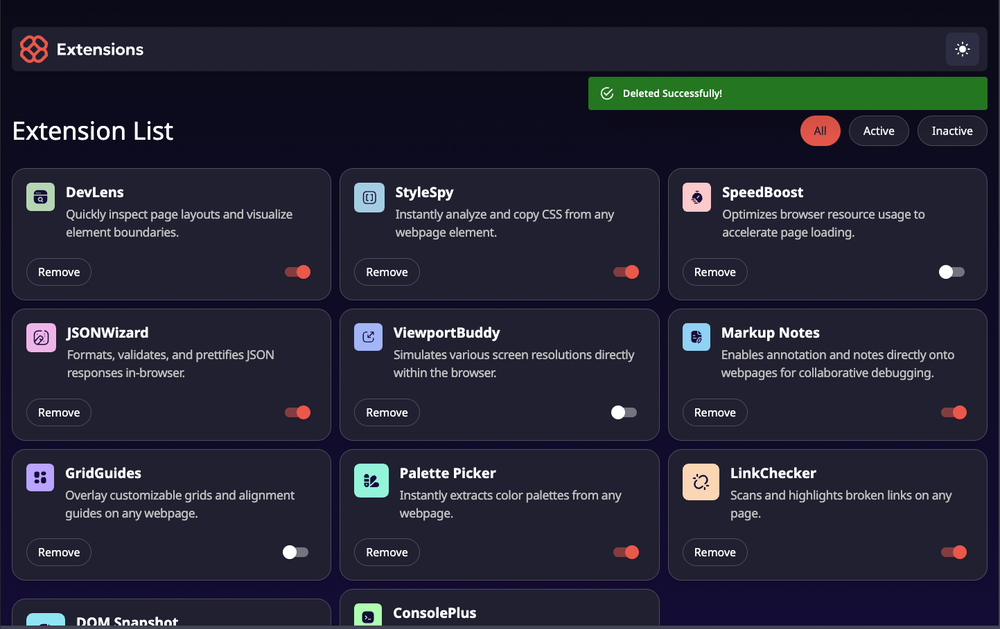
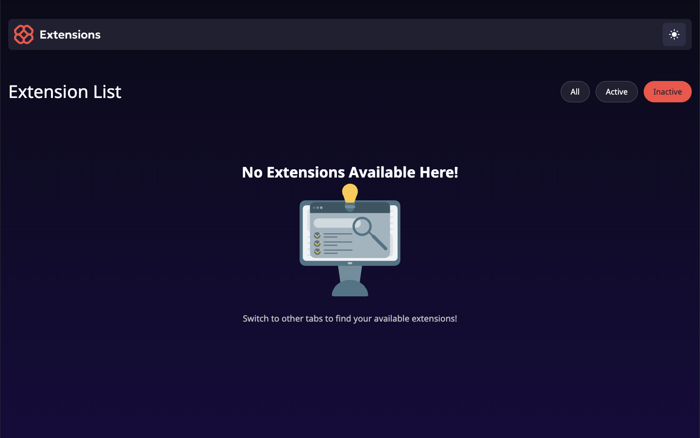

# Browser Extension Manager UI

A responsive browser extension manager UI built as part of a [FrontEndMentor challenge](https://www.frontendmentor.io/challenges/browser-extension-manager-ui-yNZnOfsMAp). This project allows users to manage browser extensions by toggling their state, filtering, removing them, and selecting a color theme, with a focus on accessibility and modern UI/UX.

## Demo
- **Live Site**: [victorkevz.github.io/browser-extensions](https://victorkevz.github.io/browser-extensions/)
- **Repository**: [github.com/VictorKevz/browser-extensions](https://github.com/VictorKevz/browser-extensions)

## Features
- **Toggle Extensions**: Switch extensions between active and inactive states.
- **Filter Extensions**: View all, active, or inactive extensions via tabbed navigation.
- **Remove Extensions**: Delete extensions with a confirmation modal.
- **Theme Selection**: Choose and persist color themes using localStorage.
- **Responsive Design**: Optimized layout for desktop and mobile devices.
- **Accessibility**: Keyboard navigation, ARIA attributes, and screen reader support.
- **Empty State**: Displays an `EmptyView` when no extensions are available in a tab.
- **Timed Alerts**: Shows a success message after deletion with a timed dismissal.
- **Animations**: Subtle hover states and exit animations for modals using Framer Motion.
- **Feature Isolation**: Developed features in isolated Git branches for clean integration.

## Tech Stack
- **Vite**: Fast build tool for development and production.
- **React**: Component-based UI library.
- **TypeScript**: Static typing for robust code.
- **Tailwind CSS**: Utility-first CSS framework for styling.
- **Material UI**: Components for accessible toggles and icons.
- **Framer Motion**: Animations for modal transitions and hover effects.
- **Local Data**: Extensions loaded from `data.json`.

## Installation
1. Clone the repository:
   ```bash
   git clone https://github.com/VictorKevz/browser-extensions.git
   ```
2. Navigate to the project directory:
   ```bash
   cd browser-extensions
   ```
3. Install dependencies:
   ```bash
   npm install
   ```
4. Start the development server:
   ```bash
   npm run dev
   ```
5. Build for production:
   ```bash
   npm run build
   ```

## Usage
- **Toggle Extensions**: Use the switch to enable/disable extensions.
- **Filter Tabs**: Click "All", "Active", or "Inactive" to filter extensions.
- **Remove Extensions**: Click "Remove" to open a confirmation modal, then confirm deletion.
- **Change Theme**: Select a theme from the header, saved to localStorage.
- **View Empty State**: If no extensions exist in a tab, an `EmptyView` is shown.
- **Accessibility**: Navigate with `Tab`, `Enter`, or `Space` for full keyboard support.

## Project Structure
```
├── public/
│   └── fonts
    └──  assets/images
├── src/
│   ├── components/      # Reusable UI components (Card, WarningModal, etc.)
│   ├── context/         # React Context for state management 
    ├── types/           # React types
│   ├── variants/        # Framer Motion animation functions
│   ├── App.tsx          # Main app component
│   └── main.tsx         # Entry point
|   └── data.json        # App's initial data
├── README.md            # Project documentation
└── package.json         # Dependencies and scripts
```

## Development Notes
- **Challenge Source**: [FrontEndMentor Browser Extension Manager UI](https://www.frontendmentor.io/challenges/browser-extension-manager-ui-yNZnOfsMAp).
- **Data**: Extensions are dynamically loaded from `data.json`.
- **Git Branching**: Features (e.g., modal, alerts) were developed in isolated branches for modularity.
- **Accessibility**: Ensured with ARIA labels, focus traps, and keyboard navigation.
- **Animations**: Used Framer Motion for modal enter/exit and hover effects.

## Screenshots





## Contributing
1. Fork the repository.
2. Create a feature branch (`git checkout -b feature-name`).
3. Commit changes (`git commit -m "Add feature"`).
4. Push to the branch (`git push origin feature-name`).
5. Open a pull request.

## License
[MIT License](LICENSE) - Free to use, modify, and distribute.

## Acknowledgments
- [FrontEndMentor](https://www.frontendmentor.io) for the challenge.
- [Vite](https://vitejs.dev), [React](https://react.dev), [Tailwind CSS](https://tailwindcss.com), [Material UI](https://mui.com), and [Framer Motion](https://www.framer.com/motion) for excellent tools.

